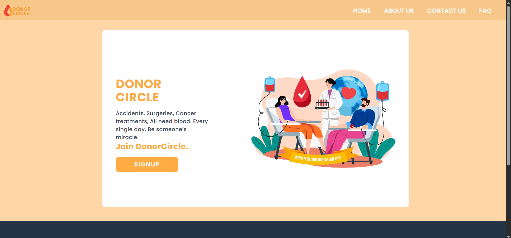

# DonorCircle 🩸

DonorCircle is a web platform where blood donors can register their details and connect directly with people who need blood. It focuses on simplicity, performance, and real-world usability.

---

## Features ✨
- User registration and login with secure password hashing 🔐  
- JWT-based authentication  🛡️    
- Dynamic localization without manual JSON updates 🌍  
- Lazy loading for better performance ⚡  
- Error boundaries to handle runtime errors smoothly 🚧  
- Responsive UI using React and TailwindCSS 📱  

---

## Tech Stack 🛠️
- Frontend: React, TailwindCSS, 
- Backend: Node.js, Express.js  
- Database: MongoDB  
- Authentication: JWT, bcrypt  

---

## Purpose 🎯
The goal of DonorCircle is to reduce the time and effort needed to find blood donors by enabling direct and reliable communication.

## ScreenShots

---

---

---

